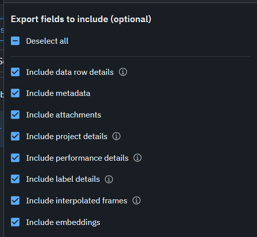

# Get-location-data

<aside>
💡 トラッキングIDを統合、Bounding Boxを補完し、完全な位置データを取得する

</aside>


## 前提

- yolov8を使用したトラッキングによりBounding BoxとIDを取得済み
- [MOTのフォーマット](https://motchallenge.net/instructions/)で記録

```bash
<frame>, <id>, <bb_left>, <bb_top>, <bb_width>, <bb_height>, <conf>, <x>, <y>, <z>, <class>
```

```bash
0, 1, 759.8, 386.7, 31.7, 29.9, 1, -1, -1, -1, player
0, 2, 1848.4, 637.5, 31.0, 31.7, 1, -1, -1, -1, player
0, 3, 1044.8, 550.9, 26.2, 27.0, 1, -1, -1, -1, player
0, 4, 811.3, 514.3, 33.0, 31.7, 1, -1, -1, -1, player
0, 5, 1703.1, 570.8, 28.3, 27.8, 1, -1, -1, -1, player
```

## IDの統合

- 検出の途切れによりトラッキングIDが同一のオブジェクトに複数ついている状態
- 一つのオブジェクトに一つのIDが対応した状態にしたい
- 動画を見て統合するIDを記録し、PythonのプログラムでIDを統合する

**Bounding BoxとIDの可視化**

- 動画上にBounding BoxとIDを表示する（draw_bboxes_on_video.pyを使用）

```bash
python draw_bboxes_on_video.py <path_to_mot_file> <path_to_input_video> <path_to_output_video>
```

**IDの変更**

- 動画を目視で確認し、PythonのプログラムでIDを変更（change_id.pyを使用）
- old_idsには15,17,18のようにコンマ区切りのIDを指定
- new_idには整数を指定
- old_idsに指定したIDがすべてnew_idに指定したIDに変更される

```bash
python change_id.py --folder_path <folder_path> --output_folder_path <output_folder_path> <file_name> <old_ids> <new_id>
```

- output_folder_pathに指定したパスのディレクトリ下に<input_file_name>_val**.txtという名前のファイルがファイルを実行するごとに作成される（**は数字）

**IDの統合**

- 変更を統合する（integrate_id.pyを使用）
- <input_file_name>_val**.txtの変更をすべて統合する
- ここで複数の選手にまたがってついたIDは削除される

<aside>
💡 IDを変更してから統合という面倒な手順を踏んでいるのは、同一IDが複数選手についている場合があったため

</aside>

```bash
python integrate_id.py --folder_path <folder_path> --changed_folder_path <changed_folder_path> --file_name <file_name> --output_folder_path <output_folder_path>
```

## Label Boxへのインポート

**Datasetsの作成**

1. Catalog内の「+ New」を選択し、データセットの名前を決める
2. 動画をアップロード
    
    <aside>
    💡 Unprocessable Contentというエラーが出る場合は以下のコマンドを使用すると良い
    
    </aside>
    
    ```bash
    ffmpeg -i <input.mp4> -vcodec libx264 -acodec aac <output.mp4>
    ```
    

**Projectの作成**

1. Annotate内の「+ New project」を選択し、タスクの種類と名前を指定
2. Project内のOverviewから「Add data」を選択
3. 追加するデータを選択し、右上の「Queue batch of ~」を選択
4. 「Submit」を選択
5. オントロジーを選択 or 作成

## Bounding Boxの補完

**アノテーション**

1. 右上の「Start」から「Start labeling」を選択
2. Bounding Boxの欠損部分を補完
    
    
    

## Label Boxからのエクスポート

1. Data Rowsからエクスポートするデータを選択
2. 「selected」タブから「Export data v2」を選択
    
    
    
3. 必要なデータを選択
    
    
    
4. 「Export JSON」を選択
5. 左下Notificationsからデータをダウンロードする

## アノテーションの反映

- Labelboxのアノテーションを反映させる（labelbox_ndjson_to_mot.pyを使用）
- MOTフォーマットのファイルをアップデート

```bash
python labelbox_ndjson_to_mot.py <ndjson_file> <txt_file>
```
